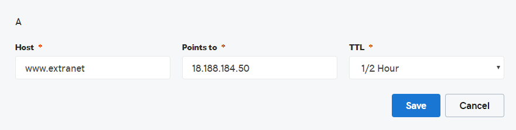

# Proxy reverso via IIS com SLL para aplicacoes legado. 

### Voce Precisar instalar no seu servidor windows

* IIS 
* URLREWRITE MODULE
* CertifyWeb

### Ter acesso a configuracao de DNS do dominio.
* Configuracao Dominio

1 - Inserir um registro A na configuracao do DNS apontando para IP do servidor.

### Instalacao do IIS / Configuracao Diretorio Virtual para o CertifyWeb

1 - Instalar IIS

2 - Apos instalado criar site 

### Instalacao do Certify Web